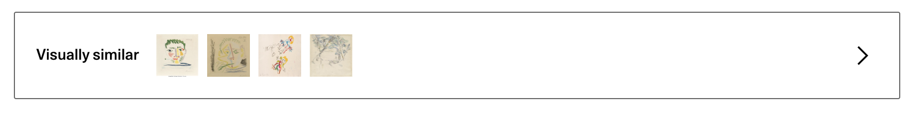

# Artwork Visual Similarity - Artsy Hackathon 2018

A proof-of-concept service and front-end UI for displaying a grid of "visually similar" artworks given an origin artwork.

This differs from Artsy's existing recommendation services in that it operates over just the artwork image - aspects like artist, historical context, medium, and artwork genome are not taken into account. This enables a different vector for browsing and discovery like "Show me works that contain primarily green tones" or "Show me works with sparse line work". Additionally, this provides a completely automated recommendation engine, as works do not need to be manually genomed in order to appear in visual similarity results. Emerging artists may appear next to highly collected artists if their works are "visually similar".

Below are some examples of the UI and similarity results:




## Files

- [download-images](download-images) - A node script to download artwork images from a subset of artists on Artsy. In its current configuration it will download around 15,000 images from just under 50 artists.
- [tensorflow](tensorflow) - Python scripts to first compute image classification vectors, then compute the 30 nearest neighbors for a given vector. Heavily based (i.e. nearly copied verbatim) on [Douglas Duhaime's "Identifying Similar Images with Tensorflow"](https://douglasduhaime.com/posts/identifying-similar-images-with-tensorflow.html) and the [Tensorflow Image Recognition](https://www.tensorflow.org/tutorials/images/image_recognition) tutorial. Outputs a JSON file for each artwork containing a list of the 30 most "visually similar" artworks and their similarity score.
- [scripts](scripts) - Automation scripts to run the above steps and start a node server that serves the JSON file when requested from the frontend UI.

## Running Locally

First, clone this repository with all submodules:

```sh
git clone --recurse-submodules
```

Build up the similarity index:

```sh
# Download the images to add to the similarity index
(cd download-images && npm install && npm run images:download)

# Compute the similarity indices, output result JSON to `static/similarity-by-artwork-id`
./scripts/compute-similarity-index.sh

# Start the server to serve the per-artwork JSON output to the frontend
./scripts/start-server
```

Run the patched associated Artsy projects, included in this repository as git submodules. Note that this assumes you've followed all relevant setup steps for [Metaphysics](https://github.com/artsy/metaphysics), [Reaction](https://github.com/artsy/reaction), and [Force](https://github.com/artsy/force) and can run the unmodified projects as-is already.

```sh
  # Start Metaphysics
  (cd ./externals/metaphysics && yarn install && yarn start)

  # Start Reaction
  (cd ./externals/reaction && yarn install && yarn start)

  # Start Force
  (cd ./externals/force && yarn install && yarn start)
```

Now, you should be able to navigate in your browser to an Artsy artwork page in Force running locally at `http://localhost:5000/artwork/:artworkID`. From here, you can trigger the visual similarity modal for any work that was indexed in the above steps.
